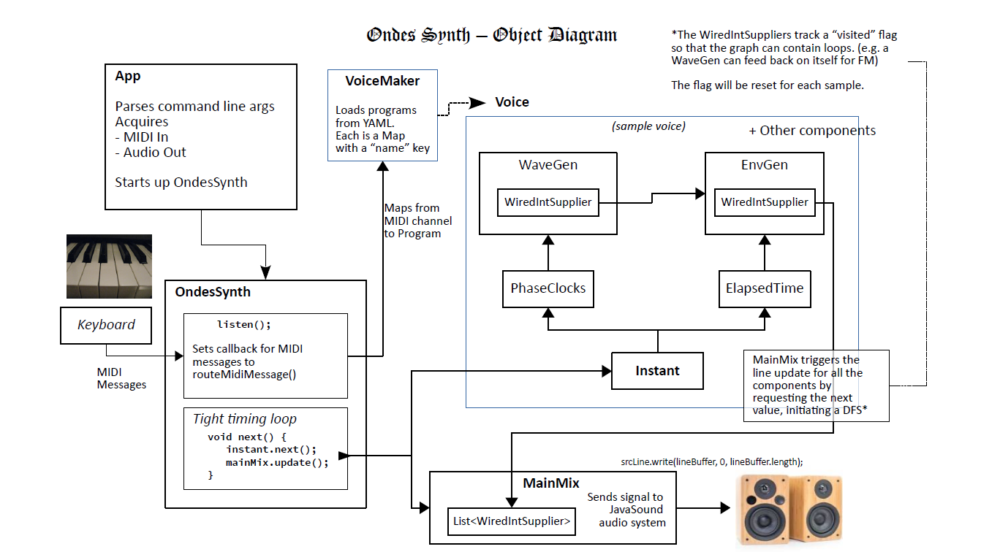

# Ondes Synthesizer
(under construction)
 

## synthesizer
The plan is for this to become a fully modular synthesizer that will play through your computer's output device as triggered by a MIDI input device (typically an electronic keyboard, though any should work). Due to the nature of computer sound, it will not be as responsive as a real synthesizer. Please see "audio buffer size" below for more.

Programs (patches) are represented in YAML files so that you will be able to either use presets or roll your own. 

Some of the tools are probably useful, but the rest is in progress, so check back soon!

## requirements 

 - Java 11 - can be obtained from [the open jdk project](https://openjdk.java.net/projects/jdk/11/)
 - Gradle - from [gradle.org](https://gradle.org/)
 - a MIDI keyboard connected to the computer
 - an audio output system (e.g. speakers)

 
There is no official packaging, so simply download or clone the project and run `gradle uberJar` to set up the jar for the shell scripts to run. (didn't I tell you it was under construction?) 

## tools
Included are some tools to show you what JavaSound thinks your system looks like. (after you build the uberJar using `gradle uberJar`)

If you're in a bash shell (including cygwin) you can use the below commands to run the tools. If not, you can look at those files to figure out how to run the java class. 

`midiInfo` - shows MIDI devices and their transmitters and receivers.

`midiMon` - monitors MIDI messages on a given device, or the default device if none is specified. Use the LABEL field from `midiInfo` to specify a device.  

`audioInfo` - shows Audio devices and their "source" and "target" lines.

---
## audio buffer size

Here we explain why the keyboard is so sluggish to respond. It's inherent in using a computer for sound via the regular sound system.

You can set the buffer size with the following argument to the ondes.App class:
  -buffer-size <size>
  
If you get nothing but clicks or sound with breaks in it, the audio buffer needs to be bigger. Default is 1024, which should work with most systems.

A limitation of computer-based sound is that the signal needs to be sent in big chunks, namely the buffer. If the buffer is too small, the audio system can't send the bytes fast enough and you get clicks or breaks as described above.

The problem with making the buffer bigger is that whenever you trigger a note, the system needs to wait for the current buffer to be processed before anything new can emerge. Since a buffer of about 1024 samples seems to be generally required, that means a delay of up to 1024/44100 seconds before the not begins to sound. How long that delay is will depend on where it happens to be in filling the buffer when you hit the note. 

The delay is called "latency." The variation in the delay is called "jitter." 

1024/44100 is about 0.023219954 seconds or 23 milliseconds. It's quite palpable. 

It's possible ASIO might help with this problem, but JavaSound offers no official support.
For more on the gory details, see: http://jsresources.sourceforge.net/faq_misc.html#asio  
  

## JavaSound naming convention

The naming Java Sound employs is confusing, as it is expressed from the perspective of the mixer or outside device rather than that of the application: 

 - MIDI 
    - transmitter - The application uses to receive MIDI messages, from a keyboard or sequencer
    - receiver - The application uses to send MIDI messages for playback, to a synth or sequencer
    
- AUDIO 
    - source - The application uses to play back sounds by sending audio data 
    - target - The application uses to receive audio data fed in from a sound or audio signal source.  
 
For the purposes of the app, I am sticking as close to the original labeling as possible, while at the same time doing my best to abstract away some of the busy work.  

