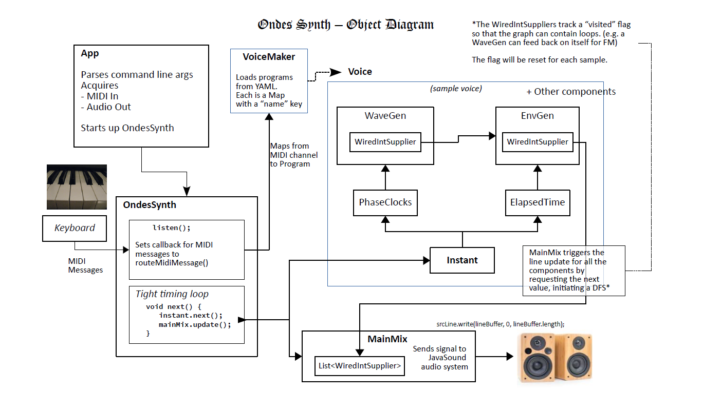

# OndeSynthesizer

A synthesizer that lets you plug together arbitrary components, which can be configured using a plain text editor and YAML.

Many key features are working now, including DX-7 style FM and a resonant sweeeping filter, though there is still a lot to explore.

To hear some of what you can do so far:
[OndeSynth demo on YouTube](https://www.youtube.com/playlist?list=PLk0M1i4FJYGJ04WGUqPTOEU0NjMNrJEqt)

There is extensive documentation starting at [Voice.md](doc/Voice.md) and there are a number of example patches included.
 

For more diagrams, see [Diagrams.md](doc/Diagrams.md)

## synthesizer
The concept is a fully modular synthesizer that will play through your computer's output device as triggered by a MIDI input device, for example an electronic keyboard. 

Programs (patches) are represented by YAML files. There are numerous examples included, but with YAML, it is easy to create new ones.

It currently works on my system by using the `run` script in the main directory like this:

        run -in 828 -out "main out" -ch1 octave -ch2 10

You may need to use the tools provided (`midiInfo` and `audioInfo`) to figure out what to tell JavaSound for the -in and -out options above. Type `run` with no arguments for command line help.

Once you settle upon inputs and outputs, you may want to put them in the file `ondes-args` so you don't have to keep typing them.

See [JavaSoundNaming.md](doc/JavaSoundNaming.md) for an explanation of how JavaSound names inputs and outputs, which is distinctly confusing.

(This is all assuming you ran Gradle to build the jar file. See below)

Given the state of computer sound responding to MIDI (sluggish) this app is generally not suitable for live performance of anything requiring timing. However, it should still be useful in cases where timing is not critical.  Please see [AudioBuffer.md](doc/AudioBuffer.md) for more on the latency responding to MIDI.  

Envelope generation is now working. There will be similar features to follow (e.g. multidimensional panning envelopes). At present, the Wave Generators and some basic IIR filtering are fairly solid within the framework.

See [the to-do file](TO-DO.md) for more on what is in the pipeline.  

## requirements 

 - Java 11 - can be obtained from [the open jdk project](https://openjdk.java.net/projects/jdk/11/)
 - Gradle - from [gradle.org](https://gradle.org/)
 - a MIDI keyboard connected to the computer
 - an audio output system (e.g. speakers)

 
There is no official packaging, so simply download or clone the project and run `gradle uberJar` or use the `b` bash script to set up the jar for the shell scripts to run.  

## tools
Included are some tools to show you what JavaSound thinks your system looks like. (after you build the uberJar using `gradle uberJar` or the `b` bash script)

If you're in a bash shell (including [cygwin](http://cygwin.org/)) you can use the below commands to run the tools. If not, you can look at those files to figure out how to run the java class. 

`midiInfo` - shows MIDI devices and their transmitters and receivers.

`midiMon` - monitors MIDI messages on a given device, or the default device if none is specified. Use the LABEL field from `midiInfo` to specify a device.  

`audioInfo` - shows Audio devices and their "source" and "target" lines.

---
### bank scripts
There are a series of bash scripts (in the `scripts` directory) that tell the app to load different sounds into the 16 channel voices and wait for MIDI input. You will probably need to adjust the -in and -out parameters for your own system.

---
## programming patches

Next you'll probably want to check out the files in the `doc` directory, starting with: 

[Voice.md](doc/Voice.md)

