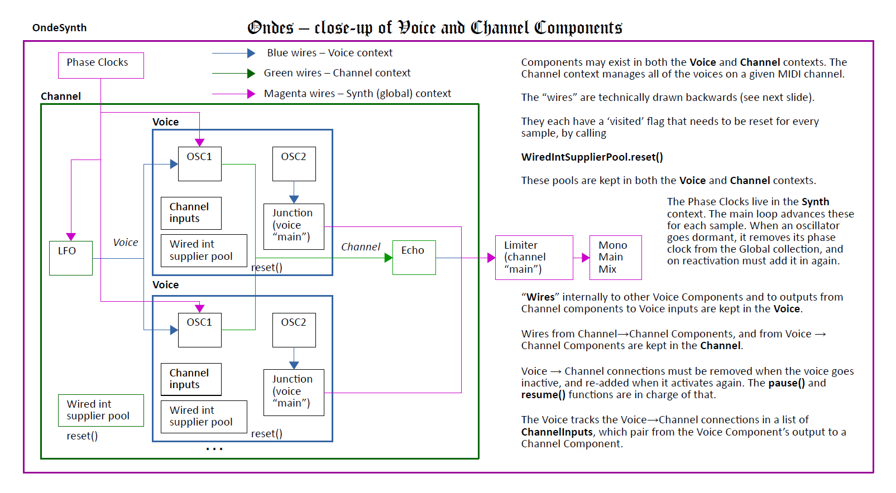
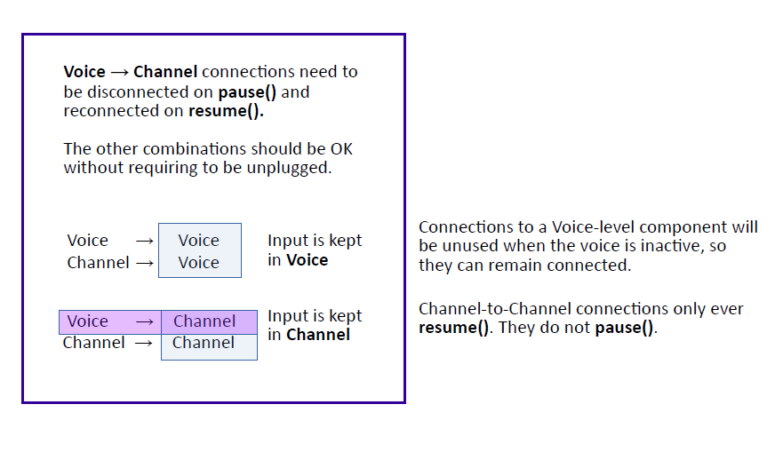
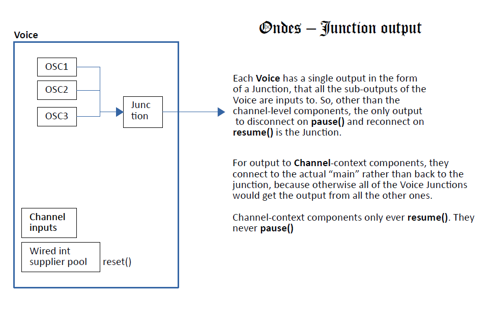

# Diagrams

The way connections work is inside-out of how you might think about it.  Adding an output to the LFO below means actually adding a Lambda to the OSC that calls LFO.currentValue().

Channel context (or "channel-level") components present some unique challenges. For example, there may be a single echo component for one MIDI channel that all of the voices plug into, rather than one for each voice on the channel. 

