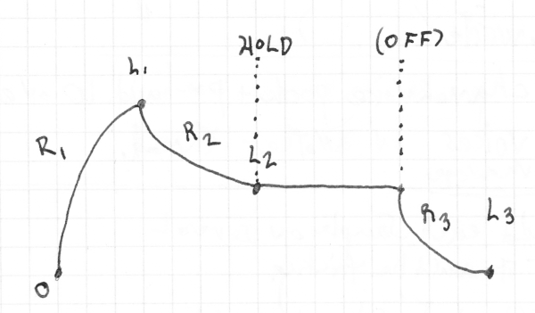
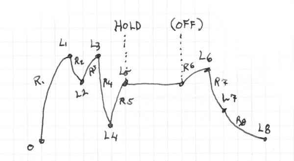

# Envelope Parameters  
  ## _under construction_
  
An Envelope has two outputs: 
 - a signal attenuated by the envelope.
 - the envelope level itself 

The latter gives the level of the envelope in a specified range, and the former is the result of a set of incoming signals attenuated by the envelope, in other words the mathematical product of a set of incoming signals and the envelope level.  
  
## A few examples:

Very simple:
```yaml
env1: 
  type: env
  midi: note-on, note-off, sustain
  preset: clavier
```
The presets are more for getting a quick result than being flexible. 

For flexibility, you want to give the points of the curve, as a set of rates and levels. The rate is in milliseconds for a full sweep from 100 to 0 or vice versa. A less-than-full sweep won't last as long, but it's logarithmic rather than linear. The first part of the transit goes by more quickly.

A classic ADSR envelope can be as simple as a few elements:

```yaml
env2:
  type: env
  exit: true
  midi: note-on, note-off, sustain
  points:
    # columns: rate level [option]
    - 30 100 
    - 50 75  hold
    - 40 0
```

which might look like this: 



Above, the simplest OFF represents the first moment where both the key is up and the sustain pedal is up. It starts the transit to the point after `hold`. If there is no point after `hold`, it goes to zero.  If the Note-OFF arrives before the envelope reaches to `hold` the behavior depends on the sustain pedal:
  - pedal is up: jump to the point after `hold` (or [0,0] if there is none)
  - pedal is down: jump to `alt-release` if it exists, or to `hold` if not.

---

You can add as many points as you like:

```yaml
env2:
  type: env
  exit: true
  midi: note-on, note-off, sustain
  points:
    # columns: rate level [option]
    - 7 100 
    - 6 75
    - 6 100
    - 4 25 
    - 10 50  hold 
    - 20 60
    - 10 30 
    - 40 0

``` 
It could look like this: 




Here's an example showing all of the keywords, **re-trigger**, **hold**, **release** and **alt-release**. If any of these appear, they _must_ appear in the exact order given. Remember that **#** indicates comments: 
```yaml
env3:
  type: env
  exit: true
  midi: note-on, note-off, sustain

  points:
    # columns: rate level [option]
    - 7 100 re-trigger # if not specified, it goes back to 0,0
    - 8 75
    - 10 60
    - 25 50 hold
    - 50 25 
    - 10 10 
    - 20 0
    # if the note releases before we get to hold, jump to here:
    - 50 10 release 
    - 20 0
    # Jump to "alt-release" after release, if sustain pedal is down
    - 100 0 alt-release

  out: main

  out-level: osc1.pwm
  out-level-amp: -1000,1000 

```

## Two definitions used below:

 - **ON state** - The last Note message received was Note-ON, or the sustain pedal is down.
 - **OFF state** - The last note message was Note-OFF, and the sustain pedal is up 

OndeSynth will not layer two notes at the same pitch on the same channel. If you hold down sustain and repeat the note, or send two Note-ONs before a Note-OFF, it will retrigger the same voice. 


## The parameters:
  - **type** - for everything on this page, must be `env`
  - **midi** - if this envelope is to do anything, it must be triggered. Typical triggers: 
  
    - **note-on** 
    - **note-off**
    - **sustain**
        
  - **exit** - If set, when this envelope finishes its cycle, it calls 
  
            synth.noteEnded(voice.midiChan, voice.midiNote)
      
       to return the voice to the pool.  
  
      Default is false. Note that in YAML, the words 'on' and 'yes' also indicate 'true', as 'off' and 'no' indicate false.


  - **preset** - either "preset" or "points" should be present, but not both. (so above, preset: is commented out.)  Current presets are: 
    - **clavier**
    - **organ**
    - **fade**
    
    The presets are mostly to simplify initial creation, so they're not meant to be flexible.
    
  - **points** - a set of points in three columns, the third being an optional qualifier. Either **points** or **preset** should be present, but not both. Each point should contain the following: 
    - rate - milliseconds to execute a full sweep from 0 to 100 or vice versa. See the discussion of rate below. 
    - level (decimal) - a level from 0 to 100, inclusive. 0 &le; level &le; 100.
    - qualifier (optional) - additional information about this point, as follows, in the order they may be encountered. All are optional. 
        - **re-trigger** - by default, a re-trigger (Note-ON arriving before this envelope has finished) will jump back to 0,0. If a re-trigger flag appears, it will jump back here instead.
        - **hold** - if the envelope reaches this point and the note is still in an "ON" state it will remain at this point until we reach an "OFF" state (definitions above).
        - **alt-release** - if we get a note-off and the sustain pedal is down, we jump to here. Jump back to the point after hold, or whatever subsequent point it had been on its way to before, when the sustain pedal goes up.  
    
  - **out** - the output of the signal attenuated by the envelope
  - **out-level** - the output of the envelope level, in a range given by the next parameter:
  - **out-level-amp** - the range of the output level. Can be either one or two numbers. If it's only one, the other limit defaults zero. The limits can be specified in either order. The 0-100 standard level of the envelope will be scaled to match the min and max levels given here. 
  
   
## Rate, meaning of

The curves are logarithmic, calculated by a simple formula that yields a logarithmic wave (weighting the attraction to the next value by how far away we are from it)

What that means is, the first half of the curve will go faster than the second half, and so on. 

A "rate" of 1000 means it takes 1000 milliseconds (1 second) to traverse from level 100 level 0. However, if you are traversing instead from 50 to 0 at a "rate" of 1000, it will take longer than a half a second, since the rate slows down as the level converges with its destination. 

 


