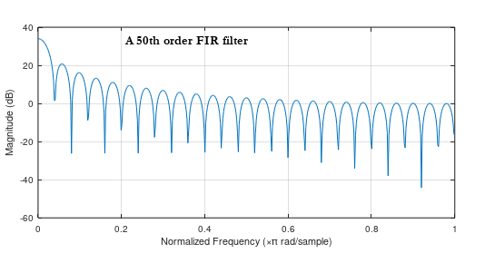

# Filter parameters

OndeSynth now has a variety of filters, including a two-pole filter with resonance that can be swept with a signal (LFO, envelope, controller)

The filter types available currently are as follows. The keyword goes in the **shape** property as shown in the examples:
 
 - **biquad** - sweeping filter with dynamic frequency and Q 
 - **iir** - fixed resonance-free filters based on the Butterworth coefficients from MatLab
 - **sinc** - an FIR filter based on a moving average with many zeros. It creates a series of notches in what's called a **sinc** wave form.
 - **sweep-sinc** - the above sinc filter, but with the ability to sweep frequency by rather crudely by adding and subtracting zeros.  Use with caution.  It seems to display extreme variations in bias, and the sweep is kind of gritty. I may look into smoothing it out at some point in the future. 


Eventually I would like a 4-pole sweeping VCF with Q like the Moog synthesizer, but one thing at a time. 

## Biquad Filter
For now, this is probably the most practical filter. It offers fairly clean variable Q and frequency. 

```
lpf:
  type: filter
  shape: biquad
  input-freq:
    amp: 1000
    range: 10000 # hz

  input-Q:
    amp: 1000
    range: 100  

  freq: 220
  Q: .5   # they say "0-5 default 1"
  level-scale: 1
  out: env
```

 - **freq** - the base frequency in hz
 - **Q** - the amount of resonance.  
 - **level-scale** - the standard multiplier
 - **out** - output routing 

The **input-freq** and **input-Q** sections are optional. The regulate modulation of the frequency and Q (resonance) as indicated.

 - **amp** (integer) parameter gives the maximum value expected from the modulator (given by **level-override** from a WaveGen, or **out-level-amp** from an envelope)
 - **range** - tells the range of the sweep.  For the frequency, it's in hertz. For the Q, it's a positive value, indicating the amount of resonance. Use your ears to adjust it.
 
Here is the frequency response for the biquad filter with a cutoff of 1000. Note that the plot encompasses the range from zero to the sampling rate, typically 44100. 
 
 
The coefficient algorithm for the biquad filter is borrowed from the Nyquist implementation of a biquad filter with Q.  For more details, see [filter notes](../notes/freq-sweep/BiQuad.md)

## FIR and IIR Filters 

There are two basic types of filters: 
 - **FIR** = Finite Impulse Response - Zeros only (no feedback) 
 - **IIR** = Infinite Impulse Response - Poles and Zeros
 
The biquad filter above, for example, is a second-order IIR filter (using Direct Form 1 for stability)

The "IR" part means "Impulse Response," which essentially means the response of the filter to a brief spike (which thus contains all frequencies). For an FIR filter, that discrete response defines the coefficients used in the filter algorithm. 

The FIR filters (Finite Impulse Response) have a finite response, after which they settle to zero. The IIR (Infinite Impulse Response) filters, however, have a feedback circuit that causes the response to theoretically go on indefinitely. 

In sound, the FIR filters will be a series of notch filters, whereas the IIR filters are capable of a wide variety of behaviors including low-pass, high-pass, and band-pass.  
 
 
## IIR filter - lowpass  

The filters with the shape **iir** are fixed-cutoff filters. For example,
Below is an IIR lowpass filter with a cutoff starting at 440 hz. 
```
lpf:
  type: filter
  shape: iir
  key: lp_4_440
  level-scale: 1
  out: main
```

These are Butterworth filters, noted for their smooth **pass-band**, **transition**, and **stop-band** curves. Other filter types are capable of sharper cutoffs, by sacrificing the evenness of the frequency response in one or more of the aforementioned bands. 
 
### key format  
Available keys for filter types presently are mnemonically labelled:

    {type}_{order}_{frequency}
    
So, **lp_6_1k** is a low-pass 6th order filter with a cutoff of 1,000 hz. For a Butterworth filter, that means 6 zeros and 6 poles.     

The higher-order filters are capable of sharper cutoffs, but also are prone to becoming unstable in lower frequencies (Meaning: loud unpleasant noise). They seem to run OK above about 2k.  

The "frequency" part assumes that the sampleRate is 44,100 hz. If the sample rate changes, the cutoff frequency will shift proportionally. 

## keys available

Below are the keys currently available:

``` 
        // 6-pole filters
        lp_6_1k   // becomes unstable easily
        lp_6_2k
        lp_6_5k
        lp_6_10k
        lp_6_15k
        lp_6_20k
        
        // 4-pole filters
        lp_4_55
        lp_4_110
        lp_4_220
        lp_4_440
        lp_4_880
        lp_4_1000
        lp_4_1600
        lp_4_3200
        lp_4_4000
        lp_4_6400
        lp_4_8000
        lp_4_10k
        lp_4_15k
        lp_4_20k

        //  1-pole filter
        lp_1_22k
    

``` 


## FIR filters 

The **sinc** and **sweep-sinc** filters are both 'notch' filters, as that is what results from doing a running average. As mentioned previously, FIR filters only have zeros, which translate into notches in the frequency response graph. 

They draw what is known as a 'sinc' wave, which is a variation of the formula ((sin x) / x), only the lobes are folded over from the negative quadrant. 

You can hear with the 'filter-test' patch how A440 and its harmonics are all blocked by this fixed-frequency filter:
```
name: filter-test

osc1:
  midi: note-on
  type: wave
  velocity-base: 100
  shape: sine
  level-scale: 2
  out: lpf

lpf:
  type: filter
  shape: sinc
  freq: 440
  out: main
```

Here is the "bode plot" for a 50th-order FIR filter (with all coefficients = 1). This will be similar to the response of the above filter.  



And here is the literal "sinc" wave, in other words sin(x)/x


## Sweeping SINC 


You can sweep the above filter by adding and removing elements from the vector running the average. Which does work, though not very smoothly. It's pretty gritty in fact.  

For now I am leaving it as-is in case it turns out to be useful. It does sound kind of cool, and there may be a way to smooth it out some. 

You can hear the current version in the `pwm-sweep` patch. 

The two components below are the LFO and the filter. See the patch YAML for the rest. 
```

    lpf-lfo:
      type: wave
      signed: true
      freq: .07
      shape: saw
      level-override: 1000
      out: lpf.sweep


    lpf:
      type: filter
      shape: sweep-sinc
      #midi: note-on
      freq: 1480 # F#5 about
      sweep-width: 24 # semitones
      input-amp: 1000
      out: main
```

 

## About Filter Theory

It turns out that filtering is one of the more mathematically complex aspects of synthesis. To fully grasp the details, you must be familiar with calculus and linear equations concepts such as convolution, poles and zeros, the Laplace transform and the Z-transform.   

However, the IIR algorithm itself is fairly straightforward, and using MatLab it is fairly easy to design various types of filters. It generates coefficients that can be used as data (in the IIRSpecLib class, for example) to drive the IIR algorithm.  

As mentioned above, the impulse response is a wave generated when a filter is subjected to a brief impulse, essentially a 'spike.' For an FIR, the impulse response is the same as the set of 'b' parameters used in the filter. An IIR, however has a response of theoretically infinite length, because unlike the FIR filter it feeds back the output (and taps into the delay of the output) back into the signal. That feedback is dictated by the 'a' parameters.  

Of the two, the IIR filter is more flexible. Since OndeSynth provides a standard IIR engine, it's possible to generate the `a` and `b` coefficients using MatLab, and plug in the data to the `IIRSpecLib` class for it to be available via a **key:** element as shown previously.


