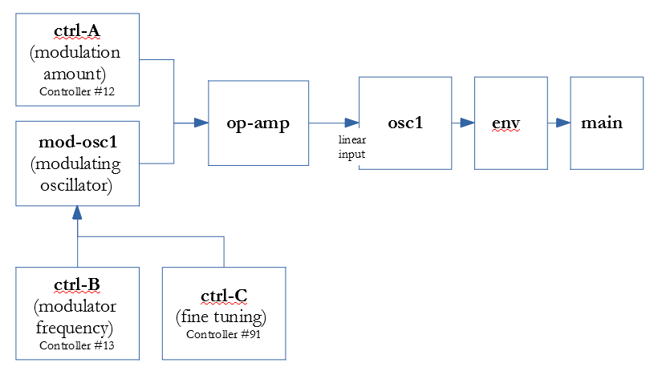

# Frequency Modulation

Oscillators will have two inputs governing frequency, both named. So the `out:` property will use the dotted notation, in order to specify the name: `log` or `linear`.

The `log` (logarithmic) input is for analog-style vibrato, and is measured in scale semitones. The `linear` input is measured in frequency. This is what you want for DX-7 style FM.   

For simplicity, I'll say the **modulating** and **sounding** oscillators, though you can use the same oscillator for both.

On the modulating side, you must give the output tag (below, **osc7.log** and **osc7.linear**)


```yaml
mod-osc6: 
  freq: 0.11
  type: wave
  shape: sine
  level-override: 1000
  out: osc7.log  # to the logarithmic input for vibrato

mod-osc8: 
  midi: note-on
  type: wave
  shape: sine
  level-override: 1000
  out: osc7.linear  # this is the one for FM  
```

On the sounding side, you can define the width of the modulation, but because the type of modulation is different, the terminology varies between the two.

For input-log, you define the width in semitones. For input-linear, it's in percentage of frequency. Both will also be affected by the envelope or other attenuation of the modulating oscillator.

In both cases, you need to specify the expected amplitude of the input. Because the input is integer, you can achieve greater accuracy by setting a higher input amplitude. This corresponds with the `level-override` of the modulating oscillator: they should be the same, to achieve unity when the incoming level is divided by the input-amp parameter. 

It's possible you would want to use both, e.g. the linear input for FM wave-forming and the log input for vibrato.  


```yaml
osc7: 
  midi-note-on
  type: wave
  shape: sine
  input-log:
    semitones: 12
    amp: 1000  # corresponds with level-override: of the input

osc8: 
  midi-note-on
  type: wave
  shape: sine
  input-linear:  
    percent: 1  
    amp: 1000  # corresponds with level-override: of the input

```

##Introspection

The **trace-linear** and **trace-relative** properties of an oscillator facilitate introspection of linear frequency modulation (AKA DX-7 style modulation) 

Set them on the WaveGen being modulated.   


- **trace-linear** - Traces the amount of linear modulation this oscillator is experiencing as the maximum modulation over a one-second time frame. For FM introspection. See [Frequency Modulatiom](FrequencyModulation.md) for more. 
- **trace-relative** - Traces the modulated frequency of another oscillator relative to the base frequency of this oscillator, in semitones. Typically, the other oscillator will be modulated by a MIDI controller. For FM introspection. See [Frequency Modulatiom](FrequencyModulation.md) for more. 

An example follows below. The diagram is followed by an explanation and the YAML you can use to try it out.

 

On my synth, Controller A is 12, B is 13, and C is 91. If yours are different, you'll need to adjust accordingly (it should be in the manual).

`mod-osc1` is the oscillator that modulates `osc1.` Its frequency starts out the same as the frequency of `osc1` which is the sounding oscillator. The frequency of `mod-osc1` can be raised using the sliders for `ctrl-B` and `ctrl-C`.  Since the MIDI standard only gives 128 distinct values for a controller, there are audible gaps in the continuity of the range of frequencies at the granularity of `ctrl-B`, so `ctrl-C` allows for fine tuning. 

`ctrl-A` governs the modulation amount, because the `op-amp` multiplies together its two inputs. So if `ctrl-A` is set to zero, there will be no modulation, whereas if it is set to full, the output of `mod-osc1` will be multiplied by 1000 (the value of the `ctrl-A.amp` property ) Again, if your controller numbers are different, you'll need to adjust them accordingly.

In the `osc1` properties, we see: 

```yaml
  trace-linear: true
  trace-relative: mod-osc1
```
These tell it to display values that you can then enter in your YAML files to get the same sound. Note that the extra display will cause occasional gaps in the sound, so for performance these should be commented out.

The first line says to track the percentage of modulation this oscillator is experiencing. We do so by taking the minimum and maximum frequency over a period of time (say one second) and comparing them with the base frequency. 

The second line says to track changes in the relative frequencies of `osc1` and the named oscillator, `mod-osc1`

The output will contain a jumble of lines like this: 

```
[osc1:mod-osc1]   FREQ DIFF:     7.0080 SEMITONES  |  osc1:    48.9994 mod-osc1:    73.4501
[osc1]      999.0000 % LINEAR MODULATION   |  base:  -440.5048  delta:   538.5037
```

The top one is reporting on the `trace-relative` amount: there are 7.0080 semitones different between the sounding and the modulating oscillator. 

The bottom one is the amount of modulation.  999% is near the top, as the amount will be 

    ctrl-A.amp * mod-osc1.level-override * osc1.input-linear.percent /
         osc1.input-linear.amp 

Remember that the `amp` property gives a max value which we expect as an input. (strictly speaking, there is no penalty for overloading it, but it helps keep output amplitude aligned with what the input is expecting)

Substituting the values when ctrl-A up full, we get:

    1000 * 1000 * 1 / 1000 = about 1000 

Below you'll find the full YAML describing this voice. You may paste it into a file in the `programs` directory and play with it. 

```yaml

#  amount of modulation [ctrl A]
ctrl-A:
  type: controller
  number: 12  # QS controller A
  amp: 1000
  out: op-amp

# frequency of modulator [ctrl B]
ctrl-B:
  type: controller
  number: 13
  amp: 1000
  out: mod-osc1.log

# fine tune modulator [ctrl C]
ctrl-C:
  type: controller
  number: 91
  amp: 128
  out: mod-osc1.log

mod-osc1:
  midi: note-on
  offset: 0
  type: wave
  shape: sine
  input-log:
    semitones: 24  #  ctrl B
    amp: 1000
  level-override: 1000
  out: op-amp

op-amp:
  type: op-amp
  out: osc1.linear

osc1:
  midi: note-on
  trace-linear: true
  trace-relative: mod-osc1
  type: wave
  shape: sine
  input-linear:
    percent: 1   # ctrl A
    amp: 1000

  out: env1
  level-scale: 6

env1:
  type: env
  exit: true
  points:
    - 100 100 re-trigger
    - 0 100 hold
    - 1000 0
    - 10000 0 alt-release

  out: main


```

