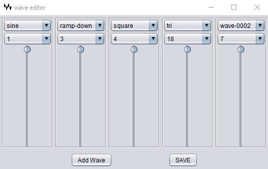

# Wave Editor 

One of the ways to create unusual waves forms is to combine harmonics at different intensities. You can do so experientially with the wave editor.



The basic principle is that a harmonic wave can be offset at any integer frequency from the fundamental of the main wave, and the combined wave will still be harmonic.  

Start up the wave editor by using the 

    w

script. It takes the same -in and -out parameters as Ondes, as described in [README.md](../README.md)

It will save any waves automatically named by a sequence number, into the waves directory. It will create the directory if it's not there. 

A sample output looks like this (it should look familiar):
```yaml
osc1:
  midi: note-on
  type: wave
  shape: harmonic
  out: main
  waves:
    - 1 1.0
    - 2 1.0
    - 3 64.0
    - 4 15.999998
    - 5 15.999998
    - 6 8.0
    - 7 6.588728
    - 8 21.11213
    - 9 70.5219
```

You can simply take this file and copy it into the program directory, and you'll have a patch to build on, that will play as-is, without needing any further enhancements. 


---  
